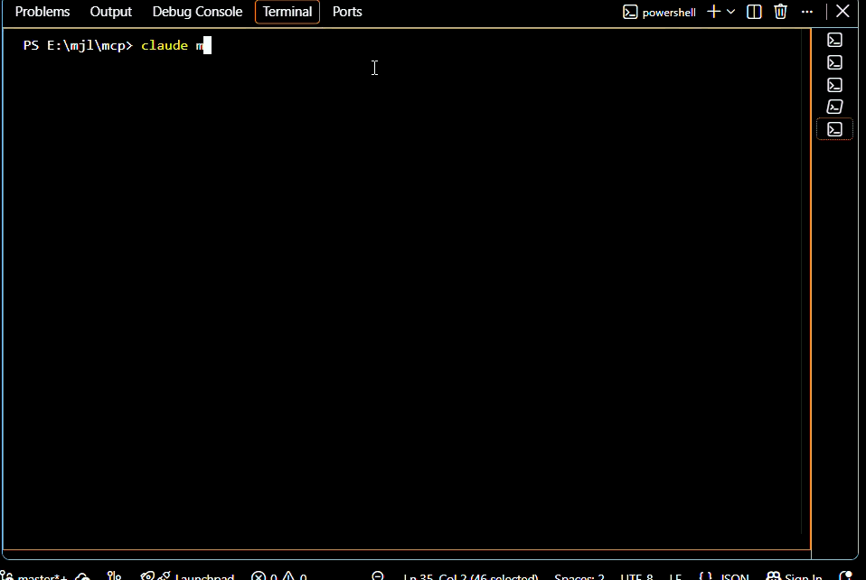

# RepoImpact

A lightweight repository intelligence engine that uses structural code analysis — not embeddings — to determine change impact and execution workflows in Python codebases, exposed through MCP.

# Demo


## The problem

Large repositories are hard for LLMs to understand efficiently.

The conventional approach is generic RAG:

```
chunk → embed → vector search → LLM
```

RepoImpact instead does:

```
AST → symbols → relationships → dependency graph → impact analysis → compact LLM context
```

Structural questions — "who calls this?", "what breaks if I change it?", "which tests cover it?" — can be answered deterministically from a call graph. They don't need semantic embeddings, and embeddings can't reliably answer them anyway (a vector index can tell you two functions are *similar*; it can't tell you one *calls* the other).

No embeddings. No vector database. No agent framework. AST + SQLite + graph traversal + MCP.

## Install

```
pip install -e .[dev]
```

Requires Python 3.11+ and the `git` executable on PATH (for cloning GitHub repositories).

## Usage

### Analyze a repository

```python
from repoimpact.repository import open_repository

session = open_repository("https://github.com/owner/repo")
# or: open_repository("/path/to/local/repo")
```

This clones (if needed), parses every `.py` file, resolves call relationships, and builds a SQLite index at `data/repositories/<repo-id>/repo.db`.

### MCP server

```
python -m repoimpact.mcp_server <github-url-or-local-path>
```

or set `REPOIMPACT_REPOSITORY` and run with no arguments. Exposes five tools: `search_code`, `find_symbol`, `analyze_impact`, `trace_workflow`, `explain`.

### LLM synthesis (optional)

`explain()` always performs deterministic analysis first — resolving the question to a symbol, then computing impact and workflow via `impact.py`/`graph.py`/`workflow.py`. Set `GEMINI_API_KEY` to also get a natural-language answer (via Gemini 2.5 Flash) grounded in that evidence:

```
export GEMINI_API_KEY=your-key-here
```

The LLM is never given repository source or asked to decide what the facts are — it only turns the already-computed symbol/impact/workflow bundle into prose (see `repoimpact/llm.py`). Without a key set, `explain()` and the Chat tab both still work, just showing the structured evidence directly instead of a prose answer. Swapping providers means adding a new `LLMProvider` subclass, not touching any other module.

### Web UI

```
streamlit run repoimpact/app.py
```

Enter a GitHub URL or local path, then use the Overview / Chat / Search / Impact tabs. The UI calls the same core engine as the MCP server — no separate logic.

### Tests

```
pytest
```

## Demo

The examples above run against [`examples/demo_repo`](examples/demo_repo), a small, deterministic Flask-style app: `POST /login` flows through `login_endpoint → login → validate_user/create_token`, and `POST /checkout` flows through `checkout_endpoint → checkout → process_payment`. Point either the MCP server or the UI at it locally to reproduce every example below exactly — `tests/test_demo_repo.py` pins these results so they can't silently drift from what's advertised here.

**Where is authentication implemented?**

```
search_code("login")
```
finds `login()` in `auth.py`, `login_endpoint()` in `routes.py`, and `test_login_success()` in `tests/test_auth.py`.

**Explain the login workflow.**

```
POST /login
    ↓
login_endpoint()
    ↓
login()
    ├── create_token()
    └── validate_user()
            └── UserRepository.get_user()
```

**Who calls `create_token()`?**

```
find_symbol("create_token")
→ callers: login(), test_login_success()
```

**What breaks if I remove `create_token()`?**

```
analyze_impact("create_token")

Impact: HIGH

Direct callers:      login, test_login_success
Indirect callers:     login_endpoint, test_login_invalid_password
Affected files:       auth.py, routes.py, tests/test_auth.py
Affected workflows:   POST /login
API entry points:     POST /login

Reason: The target has 4 downstream callers, including a detected
public API entry point and 2 related tests.
```

**Which tests are affected?**

`test_login_success` and `test_login_invalid_password` — both reach `create_token()` (directly and via `login()`, respectively).

## What makes this different

```
LLM → MCP → structured repository intelligence → AST + dependency graph → SQLite
```

The LLM is the interface. The graph is the intelligence.

RepoImpact does **not**: embed every file, build a vector database, chunk the whole repository, upload code to a third-party indexing service, or preload the entire repository into an LLM's context. It **does**: parse with Python's `ast`, resolve calls through a fixed, bounded resolution order (same-module → `self.method()` → imports → simple instance assignment → qualified module → unique-name fallback — see `plan.md` §15), store the result in one SQLite file per repository, and hand the LLM a few hundred tokens of pre-computed structural context instead of raw source.

## Symbol resolution & confidence

Every resolved call carries a confidence level, because a wrong graph edge is worse than a missing one:

- **HIGH** — same-module call, `self.method()`, resolved import, or a direct `x = ClassName()` instance assignment.
- **LOW** — resolved only via a unique-name fallback (exactly one symbol in the whole repo has that name, but nothing connects the call site to it — no import, no scope).
- **UNRESOLVED** — the name is ambiguous (multiple candidates) or unrelated to anything in the repo (e.g. an external library call). No edge is created.

`analyze_impact`'s HIGH/MEDIUM/LOW score counts only HIGH-confidence callers. LOW-confidence matches are surfaced separately as "possible references" and never silently inflate the score.

## Limitations

This is static analysis, not a type checker or a runtime tracer. It cannot perfectly understand:

- dynamic imports, monkey-patching, or reflection
- runtime-generated attributes or dependency injection
- dynamic dispatch or complex metaprogramming
- an instance whose type is only knowable from another module (e.g. a module-level singleton imported and called through, rather than instantiated locally — the resolver only tracks direct `x = ClassName()` assignments in the same file, not types inferred across a `from module import instance` import)

Impact results are **static-analysis estimates, not guaranteed production-breakage predictions**. The `LOW`/`MEDIUM`/`HIGH` impact score is a heuristic based on downstream caller count, entry-point exposure, and workflow count — not a machine-learning prediction, not a probability.

`explain()`'s natural-language synthesis step (Gemini 2.5 Flash) only ever sees the compact structured evidence already computed by `impact.py`/`graph.py`/`workflow.py` — never repository source, and it never decides what the facts are. Without `GEMINI_API_KEY` set, `explain()` still works, returning that same structured evidence without a prose "answer" field.

## Project structure

```
repoimpact/
├── repository.py     # GitHub/local-path input, cloning, session setup
├── parser.py         # AST extraction + reference resolution
├── models.py         # dataclasses — no ORM
├── storage.py        # SQLite schema + transactional reindex
├── graph.py          # call graph traversal (callers/callees, transitive)
├── search.py         # lexical/structural search, find_symbol
├── impact.py         # change-impact analysis (the flagship feature)
├── workflow.py        # execution-flow tracing from entry points
├── llm.py             # LLMProvider abstraction + Gemini implementation
├── mcp_server.py      # the 5 MCP tools
└── app.py             # Streamlit UI

examples/demo_repo/    # small, deterministic demo app used above
tests/                 # pytest suite (99 tests)
plan.md                # the full design specification this was built from
```

